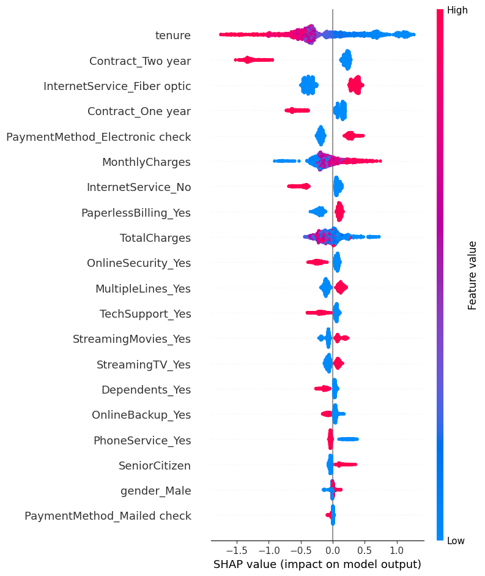
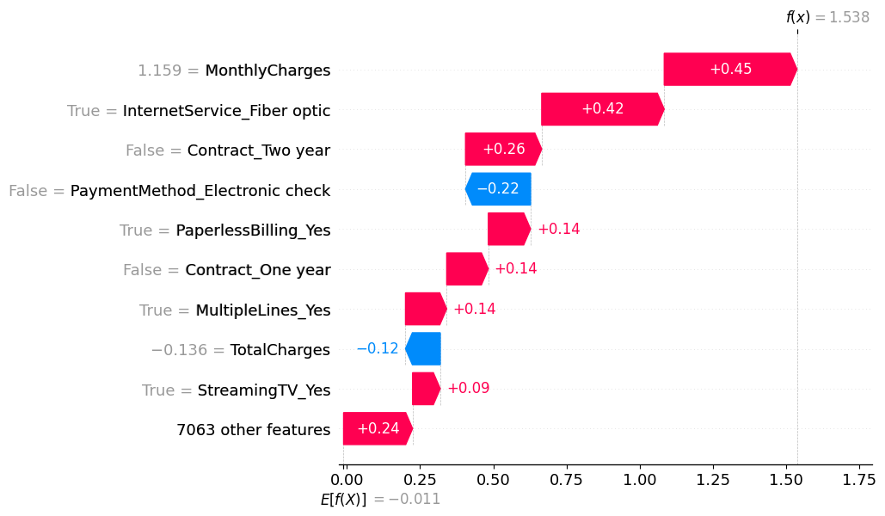

📈 Customer Churn Prediction (Telco)

End-to-end machine learning system for predicting customer churn using the Telco Customer Churn Dataset (IBM).
This project demonstrates the full applied ML lifecycle — from exploratory data analysis and feature engineering to model training, hyperparameter tuning, explainability, and deployment preparation.

🧩 Project Overview

Customer churn represents customers who discontinue their services — a key metric for subscription-based businesses today.
This project builds a predictive model to classify churn risk and reveal the key drivers behind customer attrition.

🧠 Key Features

Data Preprocessing: Cleans and encodes categorical/numeric variables.

EDA: Visualizes churn trends, correlations, and customer demographics.

Modeling: Baseline Logistic Regression and tree-based models (Random Forest, XGBoost).

Model Tuning: Uses GridSearchCV for optimized hyperparameters and cross-validation.

Model Explainability: SHAP-based feature importance and interpretability for transparent decision-making.

Containerization: Dockerized ML app for reproducibility and deployment.

Deployment-Ready: Structured to scale into an API or MLOps workflow.

📘 Notebook Walkthrough
1️⃣ Exploratory Data Analysis (EDA)

Notebook: 01_exploratory_data_analysis.ipynb
Explores dataset structure, cleans missing values (notably TotalCharges), and visualizes churn trends.
Includes demographic distributions, churn imbalance visualization, and early insight extraction.

2️⃣ Data Preprocessing & Feature Engineering

Notebook: 02_data_preprocessing_and_feature_engineering.ipynb
Encodes categorical features, scales numerical ones, and performs train/test split.
Saves processed data into /data/processed/ for model training and reproducibility.

3️⃣ Model Training & Evaluation

Notebook: 03_model_training_and_evaluation.ipynb
Trains and evaluates two models:

Logistic Regression (baseline)

XGBoost (gradient-boosted tree model)

Compares performance across Accuracy, Precision, Recall, F1-score, and ROC-AUC.
Visualizes model performance using confusion matrices and ROC curves.

4️⃣ Hyperparameter Tuning & Model Saving

Notebook: 04_model_tuning_and_saving.ipynb
Performs GridSearchCV with cross-validation to optimize key XGBoost hyperparameters:
n_estimators, max_depth, learning_rate, subsample, and colsample_bytree.
Saves the final tuned model to:

/models/xgb_churn_model.pkl

5️⃣ Model Explainability (New!)

Notebook: 05_explainability.ipynb
Explains model predictions using SHAP (SHapley Additive exPlanations).
Generates global and local feature importance plots that provide transparency into how the model evaluates churn risk.

Key visual outputs:

images/shap_summary_plot.png — feature impact summary

images/shap_bar_plot.png — mean absolute SHAP values

images/shap_local_explanation_5.png — local prediction explanation

🗂️ Project Structure
customer-churn-ml/
├── data/
│ ├── raw/ # Original Kaggle dataset
│ └── processed/ # Encoded and scaled model-ready datasets
├── notebooks/
│ ├── 01_exploratory_data_analysis.ipynb
│ ├── 02_data_preprocessing_and_feature_engineering.ipynb
│ ├── 03_model_training_and_evaluation.ipynb
│ ├── 04_model_tuning_and_saving.ipynb
│ └── 05_explainability.ipynb
├── models/
│ └── xgb_churn_model.pkl
├── src/
│ ├── preprocessing/
│ ├── training/
│ ├── evaluation/
│ └── explainability.py # SHAP explainability module ✅
├── images/
│ ├── shap_summary_plot.png
│ ├── shap_bar_plot.png
│ └── shap_local_explanation_5.png
├── requirements.txt
├── Dockerfile
└── README.md

🚀 Getting Started
1️⃣ Clone Repository
git clone https://github.com/woodskevinj/customer-churn-ml.git
cd customer-churn-ml

2️⃣ Create Virtual Environment
python -m venv venv
source venv/bin/activate # Mac/Linux
venv\Scripts\activate # Windows

3️⃣ Install Dependencies
pip install -r requirements.txt

4️⃣ Launch Jupyter Notebook
jupyter notebook

Then open:
notebooks/01_exploratory_data_analysis.ipynb

⚙️ Environment Verification (Optional)

Inside your notebook, confirm you’re running inside your virtual environment:

import sys
print(sys.executable)

Expected output:

.../customer-churn-ml/venv/bin/python

📊 Model Explainability Results

Model interpretability is powered by SHAP visualizations that highlight how each feature contributes to churn predictions.

  
 
  

✅ Current Progress

Data ingestion and EDA ✅

Preprocessing pipeline ✅

Model training & evaluation ✅

Hyperparameter tuning & model saving ✅

Model explainability with SHAP ✅

Containerization (next) 🚧

🧱 Next Steps

Containerize the model and deploy as a REST API

Integrate continuous training / CI-CD pipeline

(Optional) Create a Streamlit dashboard for real-time churn predictions

🧭 Project-Level Data & Model Lineage Diagram
data/raw/ → notebooks/01_eda → notebooks/02_preprocessing → data/processed/
→ notebooks/03_training → notebooks/04_tuning → models/xgb_churn_model.pkl
→ notebooks/05_explainability → images/ → Docker/API layer

✅ This diagram visualizes the full ML workflow:
raw → exploration → preprocessing → model training → tuning → explainability → containerization

📚 References

Telco Customer Churn Dataset — Kaggle

IBM Sample Data Science Dataset
